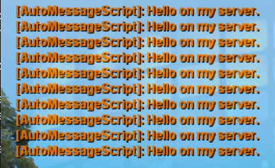

<h1 align="center">AutoMessageScript - automessage send to chat game.</h1>

### Information 

* AutoMessageScript
* Version: 1.0-SNAPSHT

### Dependencies Link & Information

Script is build of the following dependencies:

* [Lua](http://lua.org.pl/5.1/manual.html#1l)
* [MTA:SA](https://marketplace.visualstudio.com/items?itemName=subtixx.mtasa-lua)
* [Program build](https://code.visualstudio.com)
* [Wiki MTA:SA](https://wiki.multitheftauto.com/wiki/Client_Scripting_Functions)
***

### Screenshot

  

### 
Thank you for your attention 
